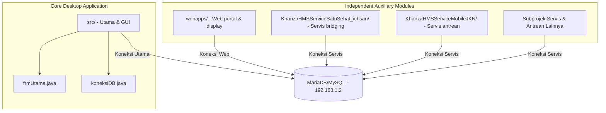

# Brain SIMRS Khanza Custom Ichsan

Selamat datang di collective memory SIMRS Khanza Custom Ichsan. Dokumen ini dirancang sebagai panduan pemahaman struktur, cara kerja, alur kerja (workflow), serta aturan keamanan data bagi AI Agent yang bekerja pada repositori ini.

---

## 📌 1. Database Development & Security Rules

> [!IMPORTANT]
> Detail akses database di server production untuk keperluan development adalah sebagai berikut:
>
> - **Host IP**: `192.168.1.2`
> - **Database Name**: `sik_dummy`
> - **Username**: `client`
> - **Password**: `epotoransu`

### 🔒 Batasan & Izin Akses Database (Wajib Dipatuhi)
1. **DIPERBOLEHKAN (ALLOWED)**:
   - Membaca data (`SELECT`).
   - Melakukan *probing* struktur tabel / melihat skema (`DESCRIBE <nama_tabel>`, `SHOW CREATE TABLE <nama_tabel>`).
   - Menjalankan kueri analitis dan audit data.
2. **DILARANG KERAS (STRICTLY PROHIBITED) Tanpa Konfirmasi Pengguna**:
   - Melakukan modifikasi skema tabel (`ALTER TABLE`).
   - Membuat tabel baru (`CREATE TABLE` / `ADD TABLE`).
   - Menghapus tabel (`DROP TABLE` / `DELETE TABLE`).
   - Melakukan perubahan DDL (Data Definition Language) apa pun.
   - *Tindakan di atas wajib dikonfirmasikan secara eksplisit terlebih dahulu kepada pengguna sebelum dieksekusi.*

---

## 📂 2. Struktur Repositori & Arsitektur Aplikasi

Repositori ini menggunakan model modular di mana **`src/`** adalah repositori kode sumber utama untuk Aplikasi Desktop utama, sedangkan direktori lain di luar `src/` adalah modul webapp atau aplikasi pendukung independen yang di-build secara terpisah.

### A. Repositori Utama Desktop: [src/](file:///C:/GITHUB/SIMRS-Khanza-custom-ichsan/src)
Ini adalah kode sumber utama untuk aplikasi desktop **SIMKES Khanza** yang berbasis Java Swing. Semua dialog pendaftaran, kasir, farmasi, laporan, dan rekam medis utama dikembangkan di bawah folder ini.
- **Konfigurasi Build**: Dibangun menggunakan Apache Ant di *root workspace* melalui file [build.xml](file:///C:/GITHUB/SIMRS-Khanza-custom-ichsan/build.xml). Menghasilkan `dist/SIMRSKhanza.jar`.
- **Kelas Utama & Antarmuka Utama**:
  - Main Dashboard: [frmUtama.java](file:///C:/GITHUB/SIMRS-Khanza-custom-ichsan/src/simrskhanza/frmUtama.java) adalah pusat pengendali antarmuka desktop.
  - Koneksi Database: [koneksiDB.java](file:///C:/GITHUB/SIMRS-Khanza-custom-ichsan/src/fungsi/koneksiDB.java). Membaca database secara terenkripsi dari [database.xml](file:///C:/GITHUB/SIMRS-Khanza-custom-ichsan/setting/database.xml) menggunakan `EnkripsiAES`.
  - Modul Utama (`src/simrskhanza/`):
    - [DlgReg.java](file:///C:/GITHUB/SIMRS-Khanza-custom-ichsan/src/simrskhanza/DlgReg.java): Dialog Admisi / Pendaftaran.
    - [DlgIGD.java](file:///C:/GITHUB/SIMRS-Khanza-custom-ichsan/src/simrskhanza/DlgIGD.java): Pelayanan IGD.
    - [DlgPasien.java](file:///C:/GITHUB/SIMRS-Khanza-custom-ichsan/src/simrskhanza/DlgPasien.java): Data Master Pasien.
    - [DlgKamarInap.java](file:///C:/GITHUB/SIMRS-Khanza-custom-ichsan/src/simrskhanza/DlgKamarInap.java): Kamar & Perawatan Rawat Inap.
    - [DlgKasirRalan.java](file:///C:/GITHUB/SIMRS-Khanza-custom-ichsan/src/simrskhanza/DlgKasirRalan.java): Pembayaran Rawat Jalan.

### B. Aplikasi Pendukung Terpisah (Build Terpisah)
Folder-folder lain di root workspace merupakan aplikasi mandiri dengan siklus build independen (memiliki file `build.xml` tersendiri):
- **Web Portal / Antrean Display**: [webapps/](file:///C:/GITHUB/SIMRS-Khanza-custom-ichsan/webapps) (berbasis PHP).
- **Subprojek Servis Bridging (NetBeans Projects)**:
  - SatuSehat custom: [KhanzaHMSServiceSatuSehat_ichsan/](file:///C:/GITHUB/SIMRS-Khanza-custom-ichsan/KhanzaHMSServiceSatuSehat_ichsan)
  - Mobile JKN / BPJS: `KhanzaHMSServiceMobileJKN/`, `KhanzaHMSServiceMobileJKNERM/`, dll.
  - Servis Absensi: `ServiceAbsensi/`

---

## ⚙️ 3. Workflow & Fitur Utama Desktop (`src/`)

### A. Alur Pendaftaran BPJS PCare (Antrean Online)
Pada modul pendaftaran PCare ([PCareCekKartu.java](file:///C:/GITHUB/SIMRS-Khanza-custom-ichsan/src/bridging/PCareCekKartu.java)), alur pendaftaran onsite diintegrasikan dengan Task Antrean Mobile JKN:
1. **Task 0 (Add Antrean)**: Mengirimkan data antrean ke Mobile JKN (`POST /antrean/add`).
2. **Task 1 (Update Hadir)**: Menandai kehadiran pasien (`POST /antrean/panggil`). Dilakukan otomatis pasca Task 0 berhasil.
3. **Simpan PCare**: Melakukan pendaftaran ke API PCare (`POST /pendaftaran`).
- Jika Task Antrean gagal, sistem akan memberikan dialog peringatan. Jika pengguna memaksa untuk lanjut (bypass), sistem mencatat log pelanggaran (`!!! PELANGGARAN ALUR BPJS !!!`) ke tabel audit trail `trackersql`.
- Status registrasi disimpan pada tabel `referensi_mobilejkn_bpjs_taskid`.

### B. Audit Trail & logging
Semua aktivitas bridging luar (BPJS, SatuSehat) dicatat ke dalam tabel database **`trackersql`** menggunakan format log yang seragam, untuk memudahkan pemantauan kendala integrasi tanpa mengganggu jalannya aplikasi.

---

## ⚠️ 4. Panduan Penting bagi AI Agent

> [!WARNING]
> Harap perhatikan hal-hal berikut saat melakukan pengembangan atau perbaikan kode:
>
> 1. **NetBeans Form Files (`.form`)**:
>    Sebanjang besar kelas GUI di `src/simrskhanza/` memiliki file `.form` pendamping. Modifikasi tata letak GUI Swing **harus** diselaraskan dengan file `.form` tersebut. Mengedit kode blok `// GEN-BEGIN:initComponents` secara manual dalam file `.java` akan terhapus secara otomatis oleh GUI Builder NetBeans ketika file dibuka kembali.
>
> 2. **Koneksi Database Mandiri untuk Log**:
>    Saat menulis fungsionalitas logging/tracking baru ke database, disarankan menggunakan koneksi terpisah (misalnya memanggil `koneksiDB.condb()`) agar tidak terjadi tabrakan kursor ResultSet yang sedang aktif di kueri utama.
>
> 3. **Sanitasi Kueri SQL**:
>    Gunakan selalu `PreparedStatement` di Java dan fungsi `cleankar()` / `validTeks()` di PHP untuk menghindari SQL Injection, mengingat aplikasi ini menangani data medis yang bersifat sensitif.
